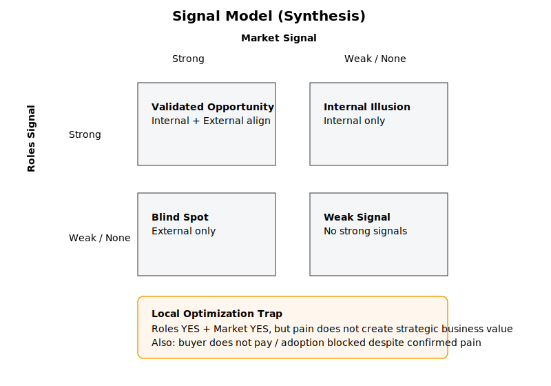
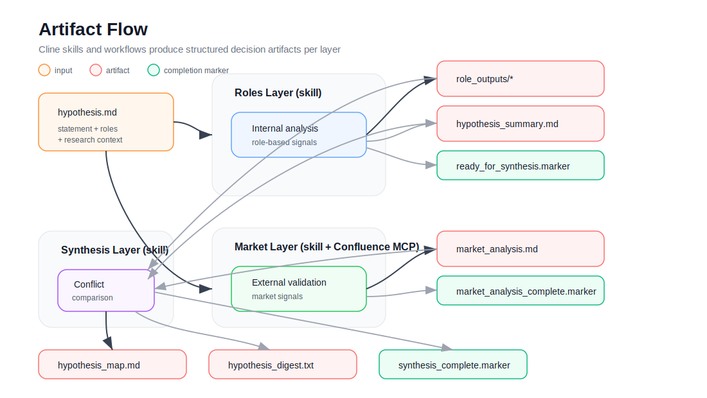

# 🧠 Hypothesis Stress Test

<p align="center">
  <b>A framework for challenging product hypotheses before you waste time building them.</b>
</p>

<p align="center">
  
</p>

<p align="center">
  <a href="./assets/architecture-overview.svg">View full diagram</a>
</p>

---

## 🚀 Why this exists

Most product teams don’t fail because they lack ideas.

They fail because they:

* validate ideas too late
* rely on intuition
* mix assumptions with reality
* avoid confronting contradictions

This framework helps answer one critical question early:

> **Should this idea exist at all?**

---

## ⚙️ How it works

📊 Diagram:
👉 [Architecture Overview](./assets/architecture-overview.svg)

The system splits reasoning into three independent layers:

* **Roles Layer** → internal perspective
* **Market Layer** → external reality
* **Synthesis Layer** → conflict & decision

---

## 🧠 Decision Model

<p align="center">
  
</p>

<p align="center">
  <a href="./assets/signal-model.svg">View full diagram</a>
</p>

📊 Diagram:
👉 [Signal Model](./assets/signal-model.svg)

Instead of confirming ideas, the system:

* separates signals
* compares perspectives
* exposes contradictions

Because:

> Truth doesn’t come from agreement.
> It comes from tension.

---

## 🔄 Artifact Flow

<p align="center">
  
</p>

<p align="center">
  <a href="./assets/artifact-flow.svg">View full diagram</a>
</p>

📊 Diagram:
👉 [Artifact Flow](./assets/artifact-flow.svg)

Each hypothesis produces a **traceable chain of artifacts**:

* internal signals
* external signals
* synthesized decision

---

## 📦 What you get

```text
outputs/
  role_outputs/*
  hypothesis_summary.md
  market_analysis.md
  hypothesis_map.md
  hypothesis_digest.txt
```

---

## 👤 Who is this for?

Primary user:

→ **Product Manager**

Assumes you already:

* know your users
* have done interviews
* understand your domain

This system does not replace discovery.

It **amplifies it**.

---

## 🧪 Example

```text
examples/example-001/
```

A real B2B case:

→ SAST scan prioritization

Where the hypothesis evolves from:

> “reduce production risk”

to:

> “improve operational efficiency”

---

## ⚙️ Framework vs Tooling

This is not a tool.

It’s a framework.

```
Framework → how to think  
Tools     → how to run it
```

You can use:

* ChatGPT
* local LLMs
* APIs
* IDE tools

---

## 🔧 How to use

1. Define hypothesis
2. Select relevant roles
3. Add research context

Then run:

```
playbooks/run-hypothesis.md
```

---

## 🧬 Principles

* Separate internal vs external signals
* No evidence → no claim
* Contradictions > consensus
* Human makes the decision

---

## 🏗 Structure

```
layers/       → reasoning model  
templates/    → execution prompts  
playbooks/    → workflows  
examples/     → real cases  
architecture/ → system design  
```

---

## 🚀 What this enables

* faster product decisions
* less wasted development
* clearer reasoning
* reduced bias

---

## ⚠️ What this is NOT

* not idea generation
* not market research replacement
* not automation system
* not AI magic

---

## 💡 TL;DR

```
idea → stress test → decision
```

Before you build it.
