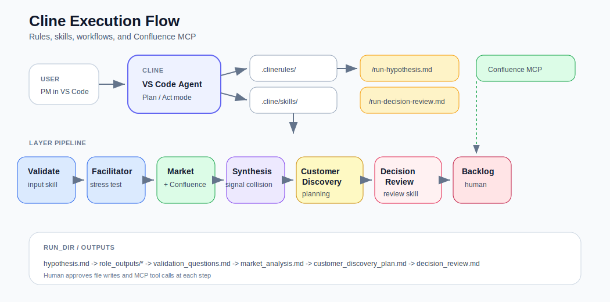

<p align="right">
  <sub>
    🌐 <b>Language:</b>
    <b>🇬🇧 English</b> ·
    <a href="./README.ru.md">🇷🇺 Русский</a> ·
    <a href="./implementations/quick-start.md">Quick Start</a> ·
    <a href="./implementations/quick-start.ru.md">Быстрый старт</a>
  </sub>
</p>

# 🧠 Hypothesis Stress Test

<p align="center">
  <b>Challenge product hypotheses before you waste time building them.</b>
</p>

<p align="center">
  A layered framework for product decision-making — run in VS Code with <a href="https://cline.bot/">Cline</a>, skills, and Confluence MCP.
</p>

<p align="center">
  <a href="./implementations/cline-setup.md"><b>Cline Setup</b></a>
  ·
  <a href="./playbooks/run-hypothesis.md"><b>Playbook</b></a>
  ·
  <a href="./examples/example-001/"><b>Example</b></a>
  ·
  <a href="./architecture/overview.md"><b>Architecture</b></a>
  ·
  <a href="./implementations/README.ru.md"><b>Документация (RU)</b></a>
</p>

<p align="center">
  
</p>

<p align="center">
  <a href="./assets/architecture-overview.svg">Open architecture diagram</a>
</p>

---

## Why this exists

Most product teams don't fail because they lack ideas.

They fail because they:

* validate ideas too late
* rely on intuition
* mix assumptions with reality
* avoid confronting contradictions

This framework helps answer one question early:

> **Should this idea exist at all?**

---

## The core idea

Do not ask an LLM to generate more ideas.

Use it to apply pressure to the ideas you already have.

```text
idea → stress test → decision
```

---

## How it works

The framework separates reasoning into three analysis layers, then a mandatory Decision Review gate:

| Phase               | Purpose                     | Output                 |
| ------------------- | --------------------------- | ---------------------- |
| **Roles Layer**     | Tests internal perspectives | role-based constraints |
| **Market Layer**    | Checks external reality     | evidence-based signals |
| **Synthesis Layer** | Exposes contradictions      | classification map     |
| **Decision Review** | Challenges conclusions      | decision_review.md     |

Run end-to-end in Cline with `/run-hypothesis.md` or phase by phase via skills and workflows.

---

## Cline implementation

<p align="center">
  
</p>

| Component | Location | Purpose |
|-----------|----------|---------|
| **Rules** | `.clinerules/` | Persistent framework invariants |
| **Skills** | `.cline/skills/` | On-demand layer execution |
| **Workflows** | `.clinerules/workflows/` | Slash commands (`/run-hypothesis.md`) |
| **Confluence MCP** | MCP config | Primary local signal source |

Setup: [implementations/cline-setup.md](./implementations/cline-setup.md)

Confluence MCP: [implementations/confluence-mcp.md](./implementations/confluence-mcp.md)

---

## Decision model

<p align="center">
  
</p>

The system classifies a hypothesis into four decision patterns:

* **Validated Opportunity** — internal and external signals align
* **Internal Illusion** — internal logic looks strong, market signal is weak
* **Blind Spot** — market signal exists, internal model misses it
* **Weak Signal** — no strong evidence from either side

---

## Artifact flow

<p align="center">
  
</p>

Every run creates a traceable decision trail:

```text
RUN_DIR/
  hypothesis.md
  outputs/
    role_outputs/*
    hypothesis_summary.md
    market_analysis.md
    hypothesis_map.md
    hypothesis_digest.txt
    decision_review.md
```

---

## Quick start (Cline)

1. Install [Cline](https://marketplace.visualstudio.com/items?itemName=saoudrizwan.claude-dev) in VS Code
2. Open this repository
3. Configure [Confluence MCP](./implementations/confluence-mcp.md)
4. Create `RUN_DIR/hypothesis.md` (see [templates/input-schema.md](./templates/input-schema.md))
5. In Cline chat: `/run-hypothesis.md` with your `RUN_DIR`

Manual fallback: [playbooks/run-hypothesis.md](./playbooks/run-hypothesis.md)

---

## Example

```text
examples/example-001/
```

A B2B AppSec hypothesis reframed from "reduce production risk" to "improve operational efficiency" — that reframing is the point.

---

## Framework vs tooling

```text
Framework  → how to think (layers, contracts, decision model)
Cline      → how to run it (rules, skills, workflows, MCP)
```

The framework is tool-agnostic. Cline is the primary supported implementation. Manual and API modes are also possible.

---

## Repository structure

```text
.clinerules/       Cline rules and workflows
.cline/skills/     Cline skills per layer
layers/            reasoning model
templates/         manual execution templates
playbooks/         usage workflows
examples/          worked examples
architecture/      system design
implementations/   Cline setup, Confluence MCP, contract
assets/            diagrams
```

---

## Principles

* Separate internal and external signals
* Confluence first for local evidence
* No evidence → no claim
* Contradictions matter more than consensus
* Challenge conclusions before backlog planning
* Human makes the backlog decision
* Bad ideas should die early

---

## What this is not

* an idea generator
* a replacement for real users
* a market research substitute
* an autonomous decision-maker

---

<p align="center">
  <b>Stress-test the idea before you build it.</b>
</p>
