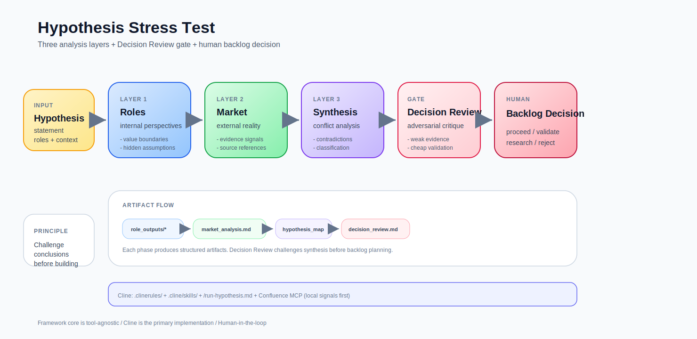

  <a href="README.ru.md">🇷🇺 Русская версия</a>

# Hypothesis Stress Test

A lightweight, local-first framework for validating product hypotheses using LLM.

This system does **not generate ideas**.
It **stress-tests them**.

---

## 👤 Who is this for?

Primary user:

→ Product Manager

This framework assumes that:

- you know your users
- you have conducted interviews
- you understand your domain

The system does not replace discovery.

It amplifies it.

---

## ⚙️ Framework vs Tooling

This is not a tool.

It is a framework.

- Framework → defines how to think  
- Tools → define how to run it  

You can use:

- ChatGPT  
- local LLMs  
- IDE tools  
- APIs  

No specific tool is required.

---

## 🧠 What is this?

This repository describes a practical approach to **product decision-making under uncertainty**.

Instead of relying on:

* intuition
* fragmented research
* internal discussions

the system separates different types of signals and **forces them into conflict**:

* internal perspectives
* external reality
* synthesis through contradictions

> Truth emerges not from agreement, but from tension between viewpoints.

---

## ⚙️ Core Concept

The framework is built around three independent layers:

### 1. Roles Layer (Internal)

Analyzes how the hypothesis behaves across different perspectives:

* user
* developer
* business
* operations

Focus:

* value boundaries
* hidden assumptions
* internal friction

---

### 2. Market Layer (External)

Validates whether the problem exists outside your head.

Uses:

* local knowledge base
* vector search
* external sources (with references)

Focus:

* real demand
* existing solutions
* signal strength

---

### 3. Synthesis Layer (Conflict)

Compares internal and external signals.

Outputs:

* validated opportunities
* internal illusions
* blind spots
* weak signals

This is where decisions become clear.

---

## 🔄 How it works

The system is executed manually:

1. Define a hypothesis
2. Run Roles Layer
3. Run Market Layer
4. Run Synthesis Layer

Each step produces artifacts.
Next step consumes them.

No orchestration required.

---

## 📦 Output Model

Each run produces:

RUN_DIR/
outputs/
role_outputs/
hypothesis_summary.md
market_analysis.md
hypothesis_map.md

---

## 🧩 Why this approach

Most hypothesis validation fails because signals are mixed too early.

This framework enforces:

* separation of perspectives
* explicit assumptions
* evidence-based validation
* conflict-driven synthesis

It turns vague thinking into a **reproducible process**.

---

## 🚀 What you get

* faster hypothesis validation
* lower cost of mistakes
* clearer decision-making

In practice:

> bad ideas die early

---

## 🏗 Architecture

* local LLM (via API)
* local knowledge base
* vector search
* optional web search with sources
* manual execution

Works in closed environments.

---

## ⚠️ Limitations

This is not:

* a replacement for real users
* an autonomous system
* a generator of ideas

Quality depends on:

* hypothesis clarity
* knowledge base quality

---

## 📘 Playbook

See `/playbooks/run-hypothesis.md`

---

## 🧬 Philosophy

LLM is not used as an assistant.

It is used as a **pressure tool**.

The goal is not to confirm an idea —
but to determine whether it survives reality.
