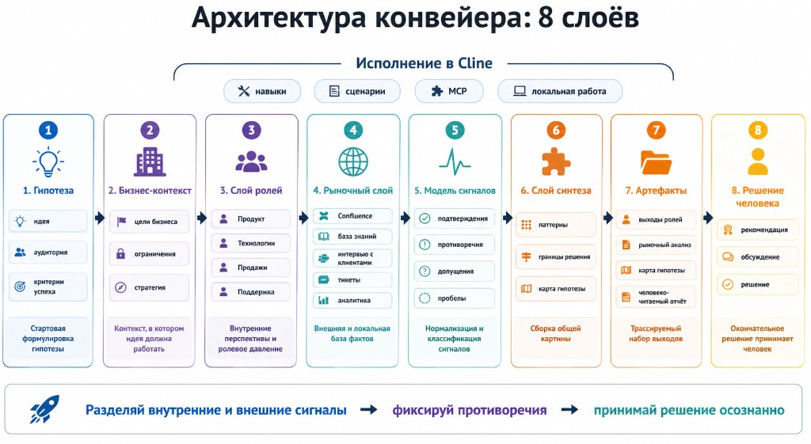
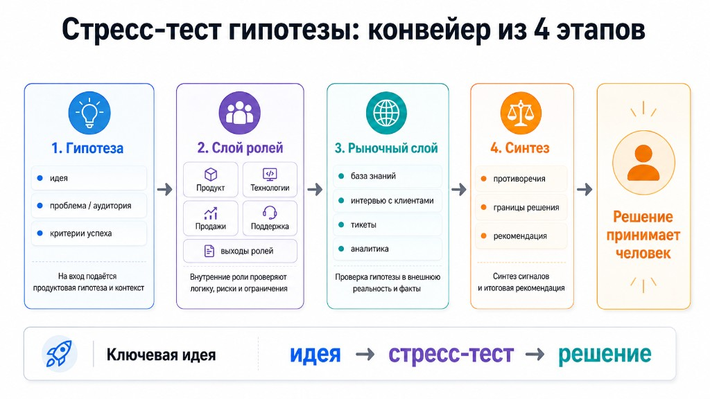
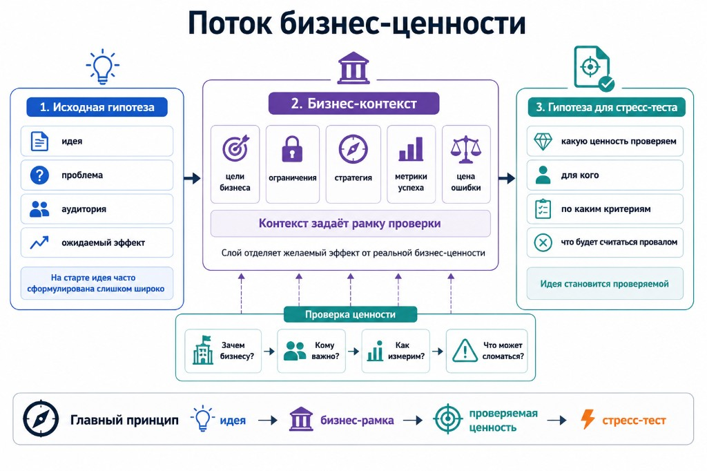
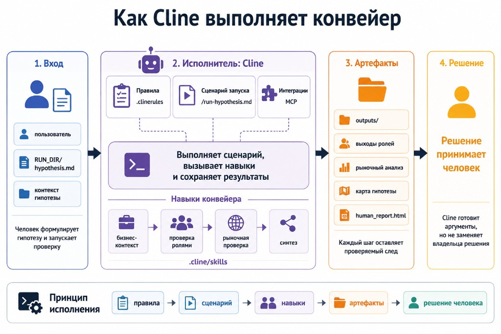
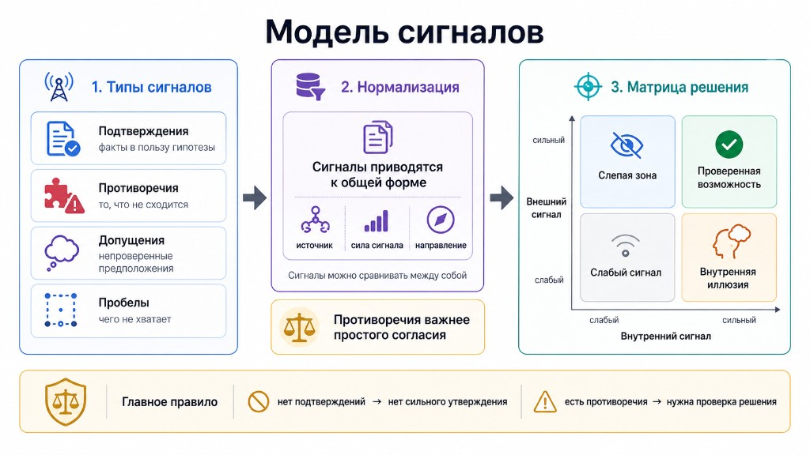
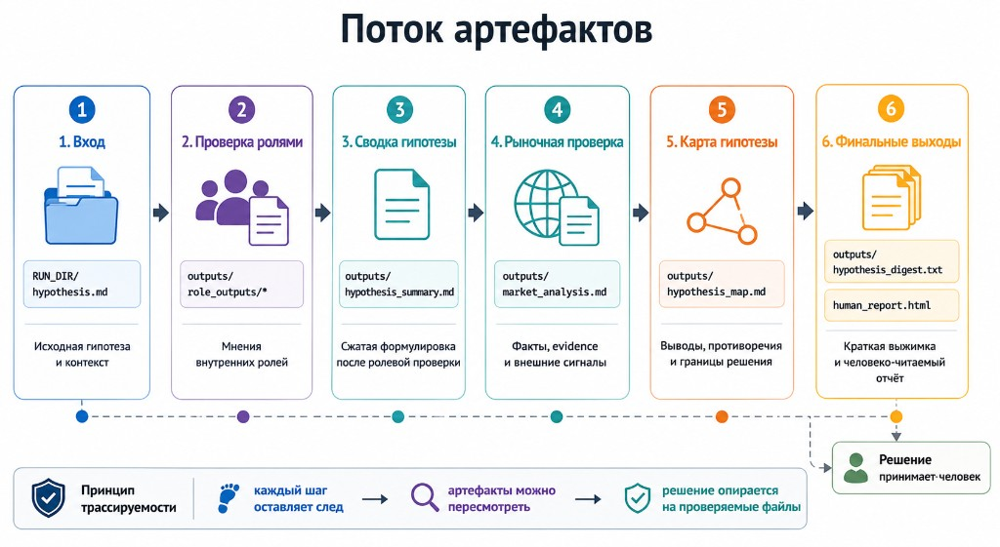
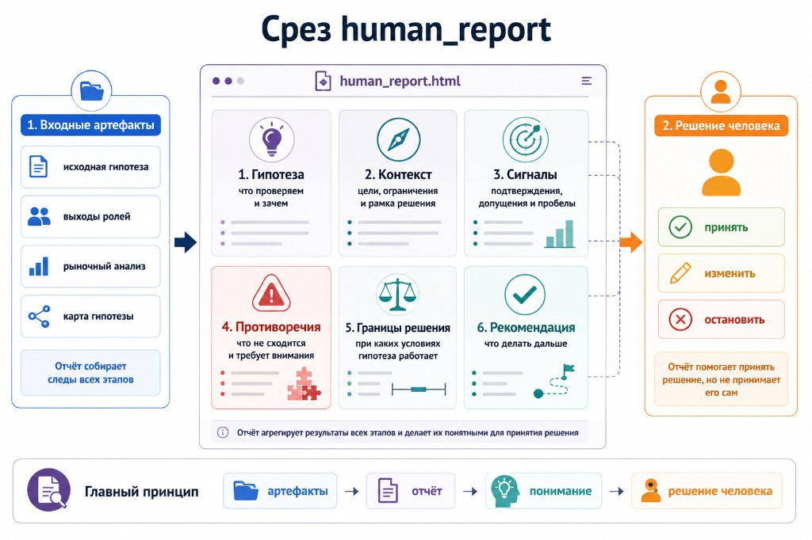
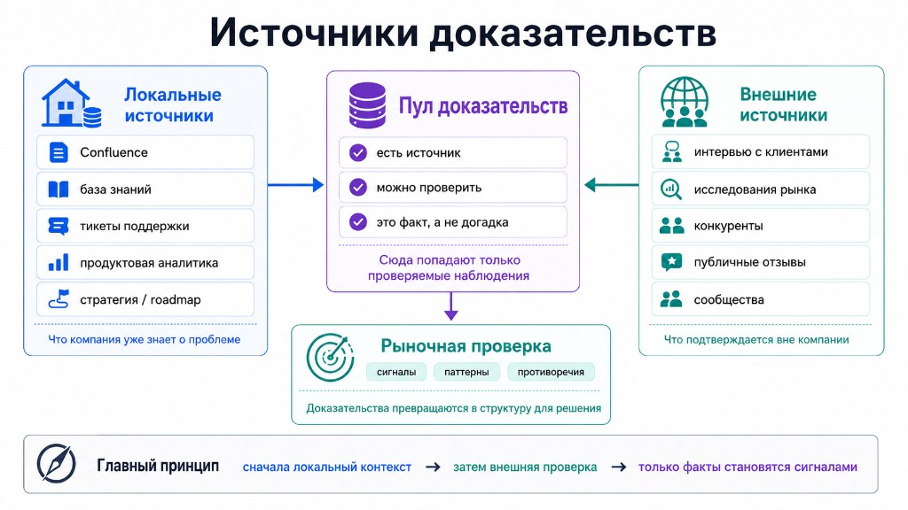

# 🧠 Hypothesis Stress Test

<p align="center">
  <sub>Версия фреймворка <b>2.4.0</b> · <a href="./CHANGELOG.md">Changelog</a></sub>
</p>

<p align="center">
  <b>Проверяйте продуктовые гипотезы до того, как начнёте их реализовывать.</b>
</p>

<p align="center">
  Слоистый фреймворк для продуктовых решений — запуск в VS Code через <a href="https://cline.bot/">Cline</a>, skills и Confluence MCP.
</p>

<p align="center">
  <a href="./implementations/quick-start.md"><b>Быстрый старт</b></a>
  ·
  <a href="./playbooks/run-hypothesis.md"><b>Playbook</b></a>
  ·
  <a href="./implementations/README.md"><b>Документация</b></a>
  ·
  <a href="./examples/example-001/"><b>Пример</b></a>
  ·
  <a href="./architecture/overview.md"><b>Архитектура</b></a>
  ·
  <a href="./roadmap/README.md"><b>Roadmap</b></a>
  ·
  <a href="./CHANGELOG.md"><b>Changelog</b></a>
</p>

<p align="center">
  
</p>

<p align="center">
  <a href="./assets/ru/architecture-overview.png">Открыть диаграмму</a>
</p>

---

## Зачем это нужно

Большинство продуктовых команд терпят неудачу не из-за отсутствия идей.

А потому что они:

* проверяют гипотезы слишком поздно
* полагаются на интуицию
* смешивают предположения с реальностью
* избегают противоречий

Этот фреймворк помогает ответить на один вопрос:

> **Стоит ли вообще реализовывать эту идею?**

---

## Ключевая идея

Не используйте LLM для генерации ещё большего количества идей.

Используйте его, чтобы **нагружать и проверять** уже существующие.

```text
идея → стресс-тест → решение
```

<p align="center">
  
</p>

---

## Как это работает

Независимые слои анализа, Customer Discovery Planning, обязательный Decision Review и финальное решение человека:

| Фаза | Skill | Результат |
|------|-------|-----------|
| **Validate** | `hypothesis-input-validation` | готовый `input/hypothesis.md` |
| **Facilitator** (Roles / stress test) | `hypothesis-facilitator` | `role_outputs/*`, `hypothesis_summary.md`, `validation_questions.md` |
| **Local Evidence Discovery** | `local-knowledge-retrieval` | `discovery_preview.md`, `evidence_inventory.md` |
| **Business Context** (ценность и стратегия) | `business-context-value-check` | `business_context_analysis.md` или `missing_business_context.md` |
| **Market** (market reality check) | `hypothesis-market-layer` | `market_analysis.md` |
| **Synthesis** (столкновение сигналов) | `hypothesis-synthesis` | `hypothesis_map.md`, `hypothesis_digest.txt` |
| **Customer Discovery Planning** | `customer-discovery-planning` | `customer_discovery_plan.md` |
| **Decision Review** | `hypothesis-decision-review` | `decision_review.md` |
| **Backlog Decision** (человек) | — | proceed / validate / research / reject |

<p align="center">
  
</p>

Слой Business Context отделяет желаемый эффект от реальной бизнес-ценности — подробнее: [layers/business-context-layer.md](./layers/business-context-layer.md)

Полный прогон (chat-first): `/run-hypothesis-conversational.md`

Полный прогон (file-first): `/run-hypothesis.md`

По фазам:

```text
/validate-hypothesis-input.md
/run-facilitator.md
/run-knowledge-retrieval.md
/run-business-context-value-check.md
/run-market-layer.md
/run-synthesis.md
/run-customer-discovery-planning.md
/run-decision-review.md
```

Указывайте `RUN_DIR` в сообщении Cline, например: `RUN_DIR: runs/HYP-2026-06-22-001`

---

## Реализация на Cline

<p align="center">
  
</p>

| Компонент | Расположение | Назначение |
|-----------|--------------|------------|
| **Rules** | `.clinerules/` | Постоянные инварианты фреймворка |
| **Skills** | `.cline/skills/` | Выполнение фаз по запросу |
| **Workflows** | `.clinerules/workflows/` | Slash-команды |
| **Confluence MCP** | MCP config | Основной источник local signals |

Настройка: [implementations/cline-setup.md](./implementations/cline-setup.md)

Confluence MCP: [implementations/confluence-mcp.md](./implementations/confluence-mcp.md)

Контракт: [implementations/cline-contract.md](./implementations/cline-contract.md)

---

## Модель принятия решений

<p align="center">
  
</p>

Synthesis (`hypothesis-synthesis`) классифицирует столкновение сигналов:

* **Validated Opportunity** — внутренние и внешние сигналы совпадают
* **Internal Illusion** — внутри всё выглядит логично, но рынок не подтверждает
* **Blind Spot** — рынок показывает возможность, но внутри её не видят
* **Weak Signal** — слабые сигналы со всех сторон
* **Local Optimization Trap** — боль подтверждена, но стратегической ценности нет

---

## Поток артефактов

<p align="center">
  
</p>

Каждый запуск создаёт трассируемую цепочку:

```text
RUN_DIR/
  input/
    hypothesis.md
    attachments/
  run.md
  outputs/
    role_outputs/*
    hypothesis_summary.md
    validation_questions.md
    market_analysis.md
    hypothesis_map.md
    hypothesis_digest.txt
    customer_discovery_plan.md
    decision_review.md
    *.marker
```

Язык артефактов совпадает с языком `input/hypothesis.md`.

---

## Human Decision Report

<p align="center">
  
</p>

`human_report.html` агрегирует артефакты всех этапов в decision-facing отчёт — решение принимает человек. Пример: [examples/example-002/outputs/human_report.html](./examples/example-002/outputs/human_report.html)

---

## Источники доказательств

<p align="center">
  
</p>

Локальные и внешние источники сходятся в пул проверяемых наблюдений — только факты становятся сигналами для Market Layer.

---

## Быстрый старт (Cline)

Полный гайд: **[implementations/quick-start.md](./implementations/quick-start.md)**

Кратко:

1. Установите [Cline](https://marketplace.visualstudio.com/items?itemName=saoudrizwan.claude-dev) в VS Code
2. Откройте **свою базу знаний** и добавьте папку `hypothesis-stress-test/` (clone или submodule)
3. Symlink `.clinerules/` и `.cline/` в корень KB — см. [quick start](./implementations/quick-start.md)
4. Настройте [Confluence MCP](./implementations/confluence-mcp.md)
5. **Chat-first (рекомендуется):** в чате Cline вызовите `/run-hypothesis-conversational.md` — `#гипотеза` для готовой формулировки или `#контекст` для сырых заметок; подтвердите draft до создания `runs/`
6. **File-first (fallback):** создайте `runs/HYP-YYYY-MM-DD-NNN/input/hypothesis.md` — см. [templates/input-schema.md](./templates/input-schema.md), затем `RUN_DIR: runs/HYP-YYYY-MM-DD-NNN` + `/run-hypothesis.md`

Операционная документация: [implementations/README.md](./implementations/README.md)

Ручной режим: [playbooks/run-hypothesis.md](./playbooks/run-hypothesis.md)

---

## Пример

```text
examples/example-001/    # AppSec — эталонный demo
examples/example-002/    # HR Tech — универсальность подхода
product-sense/           # материалы для Product Sense
humanizer/               # навыки редактуры русского (adapters + USAGE)
```

Chat-first walkthrough: [examples/chat-first-run.md](./examples/chat-first-run.md)

**example-001:** AppSec — reframe из risk reduction в operational efficiency; **Proceed with Validation**. Артефакты на **русском**.

**example-002:** HR Tech — reframe из AI auto-ranking в governed recruiter assist. Артефакты на **русском**.

Материалы конференции: [product-sense/README.md](./product-sense/README.md)

Редактура русского текста: [humanizer/README.md](./humanizer/README.md) — skill `russian-humanizer` + project voice adapters

---

## Фреймворк vs Инструменты

```text
Фреймворк  → как думать (слои, контракты, модель решений)
Cline      → как запускать (rules, skills, workflows, MCP)
```

Фреймворк не привязан к инструменту. Cline — основная поддерживаемая реализация. Возможны ручной режим и API (см. [architecture/implementations.md](./architecture/implementations.md)).

---

## Структура репозитория

```text
.clinerules/       правила и workflows Cline
.cline/skills/     skills по фазам (+ russian-humanizer для редактуры текста)
layers/            логика анализа
templates/         шаблоны для ручного режима
playbooks/         сценарии
examples/          примеры
product-sense/     материалы конференции
humanizer/         adapters и USAGE для writing skills (core в .cline/skills/russian-humanizer/references/)
runs/              прогоны гипотез (в KB workspace)
knowledge-base/    гайд по Confluence / local signals
architecture/      устройство системы
implementations/   настройка Cline, Confluence MCP
roadmap/           дорожная карта
assets/ru/         диаграммы (PNG)
assets/            legacy SVG и прочее
CHANGELOG.md       история версий фреймворка
VERSION            текущая версия фреймворка
```

---

## Принципы

* разделяй внутренние и внешние сигналы
* сначала local evidence inventory, затем Confluence как внутренний wiki-канал
* нет данных → нет утверждения
* противоречия важнее согласия
* оспаривай выводы перед backlog
* решение принимает человек
* плохие идеи должны умирать рано

---

## Чем это не является

* генератором идей
* заменой реальным пользователям и интервью
* substitute для полноценного market research
* автономным decision-maker

---

<p align="center">
  <b>Проверьте идею до того, как начнёте её делать.</b>
</p>
