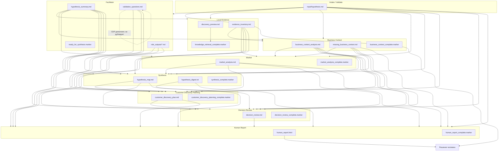
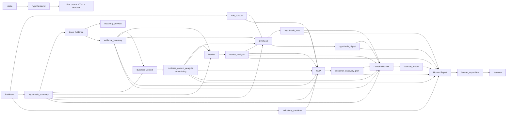

# Жизненный цикл артефактов

Кто пишет каждый файл в `RUN_DIR` и кто его потом читает. Канонический контракт имён и markers: [`.clinerules/10-artifact-contracts.md`](../.clinerules/10-artifact-contracts.md). Структура каталога: [run-structure.md](./run-structure.md).

Markers (`*.marker`) — не отчёт для человека, а замок между узлами: фаза закончена, можно идти дальше.

Три артефакта decision-среза: `hypothesis_map.md` (почему), `decision_review.md` (что делать), `human_report.html` (что читает человек).

---

## Поток артефактов

Пунктир у `validation_questions.md`: файл **рождается** в Facilitator, **дописывается** в Customer Discovery Planning.

Из двух файлов Business Context живёт **только один**: либо `business_context_analysis.md`, либо `missing_business_context.md`.

---

## Таблица жизненного цикла

| Артефакт | Рождается | Кто читает дальше | Зачем читают | Где заканчивается |
|---|---|---|---|---|
| `input/hypothesis.md` | Intake (chat-first) или человек (file-first) | Validate и **все** слои; Human Report; человек | Каноническая формулировка, роли, ID | Человек сверяет «было» с reframe |
| `role_outputs/*.md` | Facilitator | Synthesis; CDP (опц.); Human Report (ссылки) | Боль и границы роли; Decision Review не переанализирует роли | Ссылки в HTML |
| `hypothesis_summary.md` | Facilitator | Local Evidence, Business Context, Market, Synthesis, CDP, Decision Review, Human Report | Допущения, конфликты, оценка | Источник секции Role Analysis в HTML |
| `validation_questions.md` | Facilitator | Synthesis (опц.); **CDP дописывает**; Human Report | Поведенческие вопросы; CDP расширяет, не копирует | Ссылки в HTML |
| `discovery_preview.md` | Local Evidence | Следующий узел как gate; редко читают по смыслу | Аудит: что сканировали, что пропустили | Marker и архив прогона |
| `evidence_inventory.md` | Local Evidence | Business Context, Market, Synthesis, CDP, Decision Review | Факты `EVID-*`; CDP привязывает unknowns | Не встраивается целиком в HTML |
| `business_context_analysis.md` | Business Context *(если контекст есть)* | Market, Synthesis, CDP, Decision Review, Human Report | Покупатель, ценность, strategic fit | Секция «Бизнес» в HTML |
| `missing_business_context.md` | Business Context *(если контекста нет)* | Те же узлы вместо анализа | Запрет выдумывать fit; readiness = Needs business context | Секция «Бизнес» в HTML |
| `market_analysis.md` | Market | Synthesis, CDP, Decision Review, Human Report (только Signal Summary) | Внешняя реальность по каналам | Снимок сигналов в HTML |
| `hypothesis_map.md` | Synthesis | CDP, Decision Review, Human Report | Что видно только после столкновения сигналов | «Что изменилось» и противоречия в HTML |
| `hypothesis_digest.txt` | Synthesis | Decision Review, Human Report | Короткая выжимка ≤150 слов | Digest в HTML |
| `customer_discovery_plan.md` | CDP | Decision Review, Human Report | План интервью; Decision Review не переписывает его с нуля | Приоритеты валидации в HTML |
| `decision_review.md` | Decision Review | Human Report; человек | Вердикт, уверенность, дешёвая проверка | Рекомендация в HTML |
| `human_report.html` | Human Report | **Только человек** | Decision-facing срез; пайплайн больше не пишет | Backlog-решение |

---

## Markers

Узел N пишет `*_complete.marker` → узел N+1 и resume читают JSON (`status`, `completed_phase`, `next_phase`, `inputs`). Человек их не использует.

| Marker | Рождается | Кто читает |
|---|---|---|
| `ready_for_synthesis.marker` | Facilitator | Local Evidence, resume |
| `knowledge_retrieval_complete.marker` | Local Evidence | Business Context, resume |
| `business_context_complete.marker` | Business Context | Market, resume (`completed` или `skipped_missing_context`) |
| `market_analysis_complete.marker` | Market | Synthesis, resume |
| `synthesis_complete.marker` | Synthesis | CDP и Decision Review, resume |
| `customer_discovery_planning_complete.marker` | CDP | Decision Review, resume |
| `decision_review_complete.marker` | Decision Review | Human Report, resume |
| `human_report_complete.marker` | Human Report | Resume / «прогон закончен» |

---

## Схема «родился → ушёл в»

Слева узел-автор, справа потребители. Для доски: колонки = фазы слева направо, карточки артефактов в колонке рождения, стрелки только в колонки, где файл **читают**. Три толстые стрелки к HTML: `hypothesis_map` / `decision_review` / `customer_discovery_plan`.

