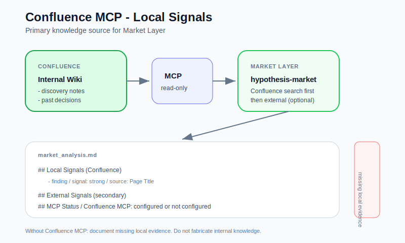

Язык: [English](./diagram.md) | **Русский**

# Диаграммы архитектуры

## Общий вид системы

  

Слои фреймворка (Roles → Market → Synthesis → Decision Review) с адаптером Cline и Confluence MCP для local signals.

## Поток артефактов

  

Как `hypothesis.md` превращается в структурированные артефакты решения через Cline skills и workflows.

## Поток выполнения Cline

  

Rules, skills, workflows и Confluence MCP на пути выполнения.

## Модель сигналов

  

Пять паттернов synthesis на основе столкновения внутренних и внешних сигналов (включая Local Optimization Trap).

## Интеграция Confluence MCP

  

Confluence как основной источник local signals для Market Layer.
