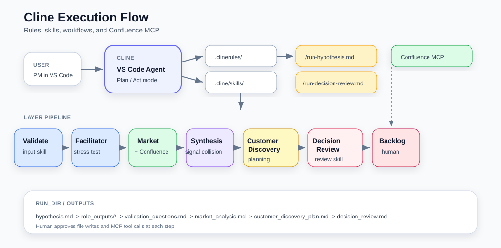

Язык: [English](./diagram.md) | **Русский**

# Диаграммы архитектуры

## Общий вид системы

  

Полный конвейер v2.4: от гипотезы и бизнес-контекста до артефактов и решения человека.

## Конвейер — 4 этапа

  

Упрощённая схема для сцены и быстрого объяснения: разделить POV → найти evidence → столкнуть сигналы → сформировать следующий шаг.

## Поток артефактов

  

Как `input/hypothesis.md` превращается в структурированные артефакты решения через Cline skills и workflows.

## Поток выполнения Cline

  

Rules, skills, workflows и Confluence MCP на пути выполнения.

## Модель сигналов

  

Пять паттернов synthesis на основе столкновения внутренних и внешних сигналов (включая Local Optimization Trap).

## Источники доказательств

  

Локальные и внешние источники evidence: Confluence, база знаний, интервью, рынок — в пул проверяемых наблюдений для Market Layer.
