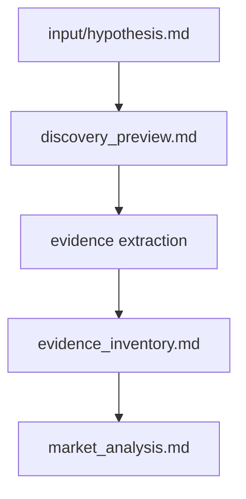

# Local Evidence Discovery (Design, Phase A)

This document defines the design for Local Evidence Discovery as an extension of roadmap P0 ("unstructured local knowledge base").

This file remains the design reference for Local Evidence Discovery.

Implementation artifacts (skill/workflow/contracts/docs integration) are tracked separately in repository files.

## 1) Purpose and boundaries

Local Evidence Discovery is not "document search."

Its goal is to collect a small, traceable set of evidence items for analysis layers.

```text
hypothesis -> local evidence discovery -> evidence_inventory.md -> market_analysis.md
```

Core principle: **no evidence -> no claim**.

### Original Phase A scope

- Retrieval architecture proposal
- `discovery_preview.md` and `evidence_inventory.md` design
- Evidence contract proposal
- Example workflow proposal

### Originally out of scope for Phase A

- Implementing new skills/workflows/templates
- Updating `.clinerules/10-artifact-contracts.md`
- Editing Market Layer implementation

## 2) Canonical workspace topology

Recommended setup:

```text
my-knowledge-base/                 <- workspace root
  discovery/                       <- example name only
  knowledge-base/                  <- example name only
  research/
  strategy/
  runs/                            <- run dirs
    HYP-YYYY-MM-DD-NNN/
  hypothesis-stress-test/          <- framework repo (must be excluded from scan)
  .clinerules/                     <- linked or copied from framework
  .cline/
```

Folder names above are illustrative, not required taxonomy.

### Scan/exclude rules (V1 design)

- Scan root: KB workspace root (recursive)
- Exclude: `hypothesis-stress-test/`, `runs/`, `.git/`, `.clinerules/`, `.cline/`, `node_modules/`
- Treat ad-hoc and mixed folders as valid sources

## 3) Unstructured KB policy

V1 assumes a "messy vault" and must be safe by default.

### Safety guardrails

Defaults to define in implementation:

- `max_files_scanned` (example: 200)
- `max_file_size` (example: 2 MB)
- `max_evidence_items` (example: 20)
- `supported_extensions` whitelist
- `skip_binary_by_default` for unsupported binaries

If a limit is reached, write explicit `limit_reached` status in preview/inventory metadata.

## 4) Supported source kinds (V1 design)

| source_kind | Examples | V1 handling |
| --- | --- | --- |
| `markdown` | `.md`, `.markdown` | read text with quote anchor |
| `text` | `.txt`, `.log`, `.csv` | read text with quote anchor |
| `image` | `.png`, `.jpg`, `.jpeg`, `.webp`, `.gif` | multimodal observation |
| `transcript` | `.srt`, `.vtt`, transcript `.md`/`.txt` | read text with timestamp/section anchor |
| `audio` | `.mp3`, `.wav`, `.m4a`, `.ogg` | use companion transcript, else metadata-only stub |
| `video` | `.mp4`, `.mov`, `.webm`, `.mkv` | use companion transcript, else metadata-only stub |

Explicitly unsupported in V1 extraction: `.pdf`, `.docx`, `.html`, `.pptx`, `.xlsx` (mark `skipped_unreadable` in preview).

## 5) Retrieval flow and preview

Preview is always produced first, then discovery auto-continues (no interactive stop in V1).



### `discovery_preview.md` (proposal)

Purpose: auditability before extraction.

Required sections:

- Limits applied
- Files scanned
- Files skipped (with reasons)
- Candidate files
- Top relevant files with planned evidence type

V1 behavior: preview generation is mandatory; extraction continues automatically after preview.

## 6) Evidence inventory proposal

`evidence_inventory.md` stores atomic local evidence, not market conclusions.

### Why Inventory Exists

`evidence_inventory.md` exists to separate retrieval from analysis.

- Retrieval discovers evidence.
- Market Layer interprets evidence.
- Synthesis resolves contradictions.
- Each layer has a single responsibility.

Example structure:

```markdown
# Evidence Inventory

## Retrieval Status
- Workspace root: my-knowledge-base/
- Limits: max_files_scanned=200, max_evidence_items=20
- Files scanned: N
- Files skipped: M
- Candidate files: K
- Evidence items: I

## Items

### EVID-001
- Source: notes_2024/workshop_queue.md
- Source kind: markdown
- Evidence type: quote
- Location: lines 12-18
- Observation: "critical projects wait several hours before scanning"
- Relevance: scan latency
- Relevance reason: Evidence mentions waiting time for critical projects before SAST scanning
- Retrieved by: local-knowledge-retrieval

### EVID-002
- Source: custdev raw/whiteboard_scan_queues.png
- Source kind: image
- Evidence type: image_observation
- Extraction note: derived from diagram labels and layout
- Observation: Whiteboard diagram labels queue "waiting 4h+" next to CI pipeline box
- Relevance: operational bottleneck
- Relevance reason: Diagram explicitly shows queue wait time in CI scanning workflow
```

## 7) Evidence contract proposal

One evidence item must represent one atomic signal, without synthesis.

Forbidden:

```text
Observation:
"Customers struggle with queue management."

Reason:
This is synthesis.
```

Allowed:

```text
Observation:
"Critical projects wait several hours before scanning."

Source:
workshop_queue.md
```

| Field | Required | Notes |
| --- | --- | --- |
| `evidence_id` | yes | `EVID-NNN` |
| `source_path` | yes | relative to KB workspace root |
| `source_kind` | yes | `markdown`/`text`/`image`/`audio`/`video`/`transcript` |
| `location` | optional | lines, heading, timestamp |
| `companion_source` | optional | transcript sidecar path for media |
| `evidence_type` | yes | `quote`, `transcript_excerpt`, `image_observation`, `metadata_only`, `observation` |
| `extraction_note` | required for `image_observation` | extraction method only |
| `observation` | yes | atomic fact or quote; no summary synthesis |
| `relevance` | yes | short topic tag |
| `relevance_reason` | yes | why item is relevant to hypothesis |
| `retrieved_by` | yes | skill and run context |

Rules:

- No generalized observations
- `metadata_only` cannot be promoted to factual claim
- If no extractable evidence exists, write explicit gap status

## 8) Market integration contract (design-only)

Market output should keep separate signal channels:

```markdown
## Local Signals from Knowledge Base
## Confluence Signals
## External Market Signals
## Inferred Signals
```

Local findings should reference `EVID-NNN`, preserve `evidence_type`, and carry `relevance_reason`.

## 9) Example workflow

```text
Hypothesis
  -> Facilitator
  -> Discovery Preview
  -> Local Evidence Discovery
  -> evidence_inventory.md
  -> Market Analysis (KB + Confluence + External + Inferred)
  -> Synthesis
```

Example candidate paths:

- `notes_2024/workshop_queue.md`
- `custdev raw/whiteboard.jpg`
- `custdev raw/2025-03-interview.srt` (+ companion `.mp4`)

## 10) Phase split

Phase A (this task): design + roadmap alignment.

Phase B (separate epic): implement skill/workflow/docs/contracts updates.
