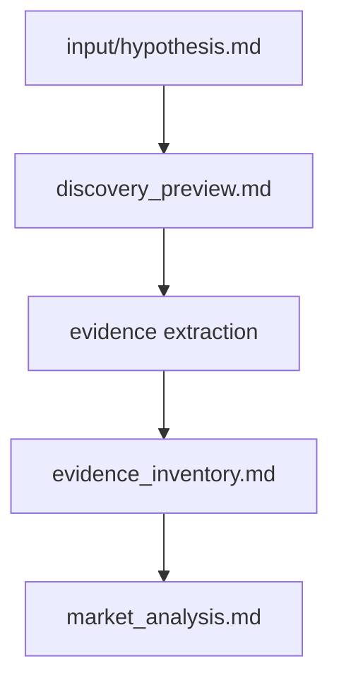

# Local Evidence Discovery (дизайн, Phase A)

Этот документ задаёт дизайн Local Evidence Discovery как расширение пункта roadmap P0 («неструктурированная локальная база знаний»).

Файл остаётся дизайн-референсом для Local Evidence Discovery.

Артефакты реализации (интеграция skill/workflow/контрактов/документации) отслеживаются отдельно в файлах репозитория.

## 1) Назначение и границы

Local Evidence Discovery — это не «поиск по документам».

Цель — собрать небольшой, трассируемый набор evidence items для слоёв анализа.

```text
hypothesis -> local evidence discovery -> evidence_inventory.md -> market_analysis.md
```

Ключевой принцип: **нет evidence -> нет утверждения**.

### Исходный scope Phase A

- Предложение архитектуры retrieval
- Дизайн `discovery_preview.md` и `evidence_inventory.md`
- Предложение контракта evidence
- Предложение примерного workflow

### Изначально вне scope Phase A

- Реализация новых skills/workflows/templates
- Обновление `.clinerules/10-artifact-contracts.md`
- Правки реализации Market Layer

## 2) Каноническая топология workspace

Рекомендуемая схема:

```text
my-knowledge-base/                 <- workspace root
  discovery/                       <- example name only
  knowledge-base/                  <- example name only
  research/
  strategy/
  runs/                            <- run dirs
    HYP-YYYY-MM-DD-NNN/
  hypothesis-stress-test/          <- framework repo (must be excluded from scan)
  .clinerules/                     <- linked or copied from framework
  .cline/
```

Имена папок выше иллюстративные, не обязательная таксономия.

### Правила scan/exclude (дизайн V1)

- Корень сканирования: корень KB workspace (рекурсивно)
- Исключить: `hypothesis-stress-test/`, `runs/`, `.git/`, `.clinerules/`, `.cline/`, `node_modules/`
- Ad-hoc и смешанные папки считать валидными источниками

## 3) Политика неструктурированной KB

V1 исходит из «messy vault» и должен быть безопасен по умолчанию.

### Safety guardrails

Дефолты, которые нужно задать в реализации:

- `max_files_scanned` (пример: 200)
- `max_file_size` (пример: 2 MB)
- `max_evidence_items` (пример: 20)
- whitelist `supported_extensions`
- `skip_binary_by_default` для неподдерживаемых бинарников

Если лимит достигнут, явно писать статус `limit_reached` в метаданных preview/inventory.

## 4) Поддерживаемые виды источников (дизайн V1)

| source_kind | Примеры | Обработка V1 |
| --- | --- | --- |
| `markdown` | `.md`, `.markdown` | читать текст с quote-якорем |
| `text` | `.txt`, `.log`, `.csv` | читать текст с quote-якорем |
| `image` | `.png`, `.jpg`, `.jpeg`, `.webp`, `.gif` | multimodal-наблюдение |
| `transcript` | `.srt`, `.vtt`, транскрипт `.md`/`.txt` | читать текст с якорем timestamp/section |
| `audio` | `.mp3`, `.wav`, `.m4a`, `.ogg` | использовать companion-транскрипт, иначе stub только с метаданными |
| `video` | `.mp4`, `.mov`, `.webm`, `.mkv` | использовать companion-транскрипт, иначе stub только с метаданными |

Явно не поддерживается извлечение в V1: `.pdf`, `.docx`, `.html`, `.pptx`, `.xlsx` (помечать `skipped_unreadable` в preview).

## 5) Поток retrieval и preview

Preview всегда создаётся первым, затем discovery продолжается автоматически (без интерактивной остановки в V1).


```mermaid
flowchart TD
  hypothesis[input/hypothesis.md]
  preview[discovery_preview.md]
  discovery[evidence extraction]
  inventory[evidence_inventory.md]
  market[market_analysis.md]

  hypothesis --> preview
  preview --> discovery
  discovery --> inventory
  inventory --> market
```

### `discovery_preview.md` (предложение)

Назначение: аудируемость до extraction.

Обязательные секции:

- Limits applied
- Files scanned
- Files skipped (with reasons)
- Candidate files
- Top relevant files with planned evidence type

Поведение V1: генерация preview обязательна; extraction продолжается автоматически после preview.

## 6) Предложение evidence inventory

`evidence_inventory.md` хранит атомарные локальные доказательства, а не рыночные выводы.

### Зачем нужен Inventory

`evidence_inventory.md` существует, чтобы отделить retrieval от анализа.

- Retrieval обнаруживает доказательства.
- Market Layer интерпретирует доказательства.
- Synthesis разрешает противоречия.
- У каждого слоя одна ответственность.

Пример структуры:

```markdown
# Evidence Inventory

## Retrieval Status
- Workspace root: my-knowledge-base/
- Limits: max_files_scanned=200, max_evidence_items=20
- Files scanned: N
- Files skipped: M
- Candidate files: K
- Evidence items: I

## Items

### EVID-001
- Source: notes_2024/workshop_queue.md
- Source kind: markdown
- Evidence type: quote
- Location: lines 12-18
- Observation: "critical projects wait several hours before scanning"
- Relevance: scan latency
- Relevance reason: Evidence mentions waiting time for critical projects before SAST scanning
- Retrieved by: local-knowledge-retrieval

### EVID-002
- Source: custdev raw/whiteboard_scan_queues.png
- Source kind: image
- Evidence type: image_observation
- Extraction note: derived from diagram labels and layout
- Observation: Whiteboard diagram labels queue "waiting 4h+" next to CI pipeline box
- Relevance: operational bottleneck
- Relevance reason: Diagram explicitly shows queue wait time in CI scanning workflow
```

## 7) Предложение контракта evidence

Один evidence item должен представлять один атомарный сигнал, без синтеза.

Запрещено:

```text
Observation:
"Customers struggle with queue management."

Reason:
This is synthesis.
```

Разрешено:

```text
Observation:
"Critical projects wait several hours before scanning."

Source:
workshop_queue.md
```

| Поле | Обязательно | Заметки |
| --- | --- | --- |
| `evidence_id` | да | `EVID-NNN` |
| `source_path` | да | относительно корня KB workspace |
| `source_kind` | да | `markdown`/`text`/`image`/`audio`/`video`/`transcript` |
| `location` | опционально | строки, heading, timestamp |
| `companion_source` | опционально | путь sidecar-транскрипта для медиа |
| `evidence_type` | да | `quote`, `transcript_excerpt`, `image_observation`, `metadata_only`, `observation` |
| `extraction_note` | обязательно для `image_observation` | только метод извлечения |
| `observation` | да | атомарный факт или цитата; без summary-синтеза |
| `relevance` | да | короткий тег темы |
| `relevance_reason` | да | почему item релевантен гипотезе |
| `retrieved_by` | да | skill и контекст прогона |

Правила:

- Без обобщённых наблюдений
- `metadata_only` нельзя повышать до фактического утверждения
- Если извлекаемых доказательств нет, явно писать статус gap

## 8) Контракт интеграции с Market (только дизайн)

Market output должен держать отдельные каналы сигналов:

```markdown
## Local Signals from Knowledge Base
## Confluence Signals
## External Market Signals
## Inferred Signals
```

Локальные findings должны ссылаться на `EVID-NNN`, сохранять `evidence_type` и нести `relevance_reason`.

## 9) Пример workflow

```text
Hypothesis
  -> Facilitator
  -> Discovery Preview
  -> Local Evidence Discovery
  -> evidence_inventory.md
  -> Market Analysis (KB + Confluence + External + Inferred)
  -> Synthesis
```

Примеры путей кандидатов:

- `notes_2024/workshop_queue.md`
- `custdev raw/whiteboard.jpg`
- `custdev raw/2025-03-interview.srt` (+ companion `.mp4`)

## 10) Разделение фаз

Phase A: дизайн + выравнивание с roadmap — **завершена**.

Phase B: интеграция skill/workflow/docs/контрактов — **завершена** (v2.3.0).

Канонические mixed-source outputs discovery см. в `examples/example-001/`.
