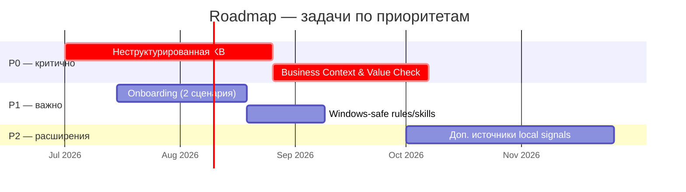

# Дорожная карта

План развития фреймворка Hypothesis Stress Test.  
Документ только на русском языке.

## Обзор

> Сроки на диаграмме **ориентировочные** — для навигации по приоритетам и зависимостям. Детали — в разделах ниже.



| Задача | Приоритет | Статус | Зависимости |
| ------ | --------- | ------ | ----------- |
| [Неструктурированная KB](#p0--поддержка-неструктурированной-базы-знаний) | P0 #1 | запланировано | — |
| [Business Context & Value Check](#p0--business-context--value-check-проверка-бизнес-контекста-и-ценности) | P0 #2 | запланировано | P0 #1 (частично; при структурированной KB — можно раньше) |
| [Onboarding (2 сценария)](#p1--упрощение-onboarding-два-пользовательских-сценария) | P1 | запланировано | — |
| [Windows-safe rules/skills](#p1--windows-safe-подключение-rulesskills) | P1 | запланировано | Onboarding |
| [Доп. источники local signals](#p2--дополнительные-источники-local-signals) | P2 | идея | P0 #1 (желательно) |

Приоритеты:

| Уровень | Значение |
| ------- | -------- |
| **P0** | Критично для практического использования |
| **P1** | Важно, но не блокирует текущий прогон |
| **P2** | Улучшения и расширения |

---

## P0 — Поддержка неструктурированной базы знаний

**Статус:** запланировано  
**Приоритет:** первый пункт roadmap

### Зачем

Сейчас фреймворк хорошо работает со структурированными артефактами:

- `RUN_DIR/input/hypothesis.md`
- `knowledge-base/personas/`, `interviews/`, `persona-builds/`
- Confluence через MCP

В реальности база знаний часто **неструктурирована**:

- свободные заметки без единой схемы
- скриншоты, диаграммы, фото whiteboard
- аудиозаписи интервью (с транскриптом или без)
- смешанные папки без фиксированной таксономии
- черновики в разных форматах и с разной степенью готовности

Без поддержки таких источников Market Layer и Customer Discovery Planning теряют local evidence и опираются в основном на Confluence или внешние источники.

### Цель

Научить фреймворк находить, интерпретировать и цитировать evidence из неструктурированной KB, сохраняя правила качества доказательств (`local` / `external` / `inferred`, no evidence → no claim).

### Область работ

- Поддержка гетерогенных локальных источников:
  - markdown и plain text
  - изображения (png, jpg, webp, скриншоты)
  - аудио (метаданные, транскрипты, ссылки на файлы)
- Стратегия discovery по «грязным» папкам KB без обязательной схемы именования
- Извлечение сигналов с привязкой к конкретному файлу/фрагменту
- Маппинг в существующую модель сигналов Market Layer
- Обратная совместимость с текущими контрактами `RUN_DIR`

### Вне scope (на этом этапе)

- Полная замена Confluence-first поведения
- Считать вывод модели доказательством без ссылки на источник
- Принудительная жёсткая схема KB для пользователя

### Ожидаемые результаты

- Спецификация discovery для неструктурированных источников
- Правила извлечения evidence из заметок, изображений и аудио
- Обновление Market Layer, evidence rules и связанной документации
- Пример прогона с mixed-source local evidence

### Критерии готовности

- Прогон даёт полезные local signals даже при «грязной» KB
- `market_analysis.md` содержит findings со ссылками на конкретные источники (файл, страница, фрагмент)
- Структурированные workflow (`RUN_DIR`, personas, interviews) продолжают работать без изменений для пользователя

### Затрагиваемые компоненты (план)

- `hypothesis-market-layer` — расширение local signal retrieval
- `.clinerules/20-evidence-rules.md` — правила для mixed-format sources
- `knowledge-base/` — документация по неструктурированным материалам
- `implementations/quick-start.ru.md` — сценарии «есть своя KB»

---

## Зависимости между P0

Два приоритетных пункта связаны между собой:

1. **P0 #1 — неструктурированная KB** даёт доступ к материалам стратегии в «грязной» базе знаний (`strategy/*`, `okr/*`, `business-model/*` и эквиваленты).
2. **P0 #2 — Business Context & Value Check** использует эти материалы для проверки бизнес-механизма ценности.

```text
P0 #1 (Unstructured KB)
  → находит strategy/okr/business-model в KB
P0 #2 (Business Context & Value Check)
  → строит карту ценности и strategic fit
  → передаёт сигнал в Market / Synthesis
```

Без P0 #1 слой P0 #2 может работать только при уже структурированной KB.  
Без материалов стратегии в KB P0 #2 не анализирует гипотезу, а фиксирует gap (`missing_business_context.md`).

---

## P0 — Business Context & Value Check (проверка бизнес-контекста и ценности)

**Статус:** запланировано  
**Приоритет:** второй пункт roadmap (зависит от P0 #1 и от наличия стратегии в KB)

### Проблема

Сейчас фреймворк отвечает на вопросы:

- есть ли боль?
- есть ли рынок?
- есть ли подтверждение?
- есть ли противоречия?
- что исследовать дальше?

Но нигде не задаётся ключевой B2B-вопрос:

> Если всё это правда, почему компания должна этим заниматься?

Большинство продуктовых гипотез погибают не потому, что проблема не существует.  
Они погибают потому, что проблема существует **не у того человека** — или не создаёт бизнес-ценность для компании.

Типичный провал:

| Сигнал | Статус |
| ------ | ------ |
| Problem Exists | да |
| Market Confirms | да |
| Users Want It | да |
| Revenue / Strategic Impact | неизвестно |

Текущий фреймворк может ошибочно считать такую ситуацию успешной, хотя в реальности это плохая инвестиция.

### Reference case (B2B AppSec)

- Developer: «мне неудобно работать»
- AppSec Engineer: «да, это неудобно»
- Интервью и рынок подтверждают проблему
- Но CISO не принимает решение о покупке на основании этой возможности
- Или фича не помогает выигрывать тендеры
- Или клиенты готовы жить без неё ещё 5 лет

### Какой вопрос решает слой

Не:

> Сколько денег принесёт?

На это почти никогда нет данных на ранней стадии.

А:

> Через какой механизм эта гипотеза может создать ценность для бизнеса?

Слой строит **карту движения ценности**:

```text
Проблема
  ↓
Получатель пользы
  ↓
Изменение поведения
  ↓
Бизнес-эффект
```

Для каждой гипотезы нужно понять:

- кто получает пользу?
- кто принимает решение?
- кто платит?
- кто внедряет?
- кто сопротивляется?

Очень часто это разные люди. Роли анализируются независимо в Stress Test, но никто не отвечает: **кто вообще готов за это платить?**

### Ключевая идея

Слой **не** отвечает: делать или не делать?

Слой отвечает:

> Если гипотеза подтвердится, как именно она создаст ценность для бизнеса?

И имеет право зафиксировать:

> Проблема реальна, но бизнес-кейс пока не доказан.

Для сложных B2B-продуктов это зачастую важнее любого анализа ролей или рынка.

### Поведение skill (план)

**Шаг 1 — Проверка бизнес-контекста**

Искать в KB (после P0 #1 или в структурированных папках):

- `strategy/*`
- `okr/*`
- `business-model/*`
- сегментация, GTM, positioning (эквиваленты)

Если данных нет:

- **не анализировать**
- создать `missing_business_context.md` со списком отсутствующих источников

**Шаг 2 — Карта заинтересованных сторон**

Построить цепочку, например:

```text
Developer          → получает пользу
AppSec Lead        → использует результат
CISO               → принимает решение
Budget Owner       → финансирует
```

**Шаг 3 — Механизм создания ценности**

Классифицировать тип бизнес-эффекта (не деньги, а механизм):

- Revenue Driver
- Retention Driver
- Competitive Driver
- Adoption Driver
- Operational Driver

**Шаг 4 — Проверка связи со стратегией**

Пример:

- Стратегия: «отобрать долю у Appscreener»
- Вопрос: «эта гипотеза помогает выиграть тендер?»
- Если нет: `Strategic Fit = Low`

### Артефакты (целевой контракт)

**`business_context_analysis.md`** — полный анализ:

```markdown
# Business Context Analysis

## Доступный контекст
...

## Недостающий контекст
...

## Карта заинтересованных сторон
...

## Поток создания ценности
...

## Тип бизнес-эффекта
- Revenue Driver
- Retention Driver
- Competitive Driver
- Adoption Driver
- Operational Driver

## Связь со стратегией
...

## Основные риски
...

## Основные возможности
...
```

**`missing_business_context.md`** — только если не хватает данных для анализа.

**`business_context_complete.marker`** — сигнал готовности для следующих слоёв (будущая интеграция).

### Место в пайплайне (целевое)

```text
Hypothesis
  ↓
Hypothesis Stress Test (Roles)
  ↓
Business Context & Value Check   ← новый слой
  ↓
Market Reality Check
  ↓
Hypothesis Synthesis
  ↓
Customer Discovery Planning
  ↓
Decision Review
```

### Критерии готовности

- Слой отделяет «problem exists» от «business case plausible»
- При отсутствии стратегии в KB создаётся явный gap-артефакт, а не «успешный» вывод
- Synthesis получает сигнал о strategic fit и value mechanism
- Reference case AppSec (Developer/AppSec vs CISO/budget) воспроизводим в примере

### Затрагиваемые компоненты (будущая реализация)

- новый skill: `business-context-value-check` (рабочее имя)
- workflow: `/run-business-context-value-check.md`
- layer doc + manual template
- обновление `.clinerules/00-hypothesis-framework.md`, `10-artifact-contracts.md`, playbooks, diagrams — после утверждения roadmap

---

## P1 — Упрощение onboarding (два пользовательских сценария)

**Статус:** запланировано

Явно описать и упростить два пути:

1. **Нет своей базы знаний** — работа из корня `hypothesis-stress-test`, без bridge-папок
2. **Есть своя база знаний** — `hypothesis-stress-test/` внутри KB + `.clinerules`/`.cline` в корне workspace (копия или junction)

Для сценария «есть KB» рекомендуется хранить материалы стратегии — это prerequisite для P0 #2:

- `strategy/` — стратегия, positioning, GTM
- `okr/` — цели и приоритеты
- `business-model/` — сегментация, монетизация, unit economics (если есть)

Без этих материалов Business Context & Value Check создаст `missing_business_context.md` вместо анализа.

Включить Windows-safe инструкции (копирование по умолчанию, junction как advanced).

---

## P1 — Windows-safe подключение rules/skills

**Статус:** запланировано

- Документировать `robocopy` как дефолт для синхронизации `.clinerules` и `.cline`
- Junction (`mklink /J`) — как продвинутый вариант
- Убрать из quick-start неоднозначные команды (`&&` в PowerShell 5.1, `mklink` без `cmd /c`)

---

## P2 — Дополнительные источники local signals

**Статус:** идея

- Jira / Linear
- Slack
- Веб-поиск для external signals (с явным approval)

См. также внутренний список задач: [architecture/todo.md](../architecture/todo.md).
